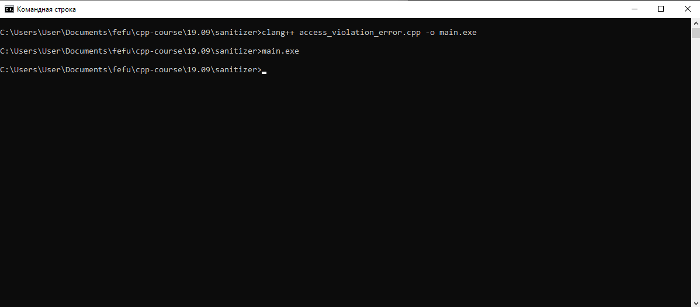
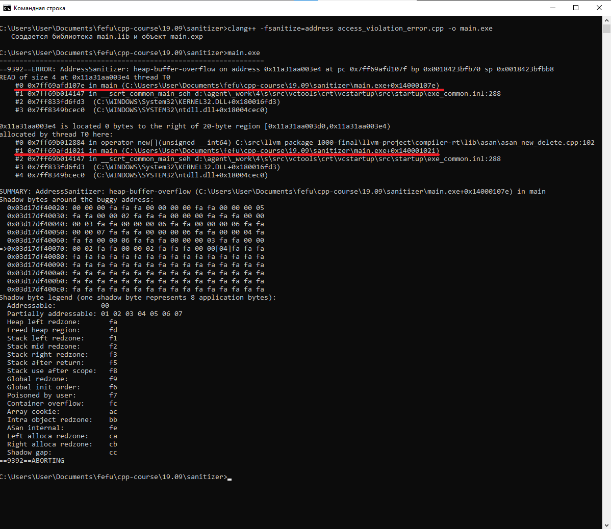
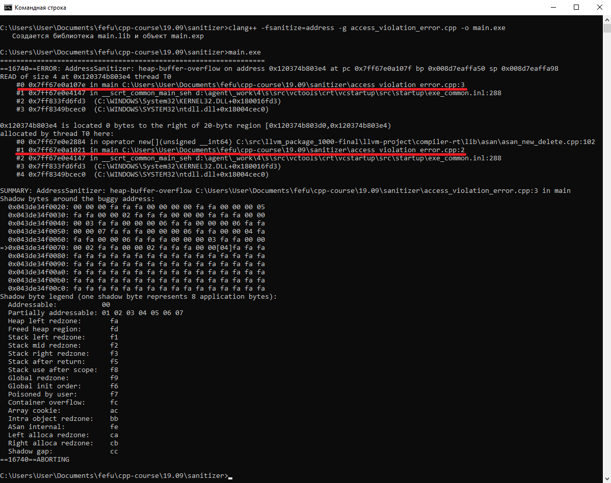

# clang sanitizer

При запуске собранного проекта `C++` возможно не заметить различных ошибок, связанных с обращением к блокам памяти, к которым у пользователя (программиста) доступа не должно быть. Более того, возможно, что при запуске проекта с явными ошибками, собранный билд не упадет при запуске.
Пример кода с ошибкой:
```cpp
int main() {
    int* ptr = new int[5];
    return ptr[5];
}
```
При сборке проекта с данным исходником и запуске билда никаких ошибок выведено не будет.

Для того, чтобы отловить подобные баги, возможно воспользоваться "адрес-санитайзером", поставляемым с компилятором clang. Для этого нужно скомпилировать исходники с флагом `-fsanitize=address`.

Если обратить внимание на подчеркнутые строки в изображении выше, то можно увидеть, что ошибка произошла в функции main по "определенному адресу". Для того, чтобы можно было увидеть номер строки в исходнике, где именно произошла ошибка, необходимо скомпилировать исходники с флагом `-g`.

Помимо "адрес-санитайзера" с clang можно собрать проект с использованием многих других видов санитайзеров, однако большинство из них доступно только на *UNIX-like системах. Подробнее о них возможно прочесть на сайте [LLVM](https://clang.llvm.org/docs/index.html).