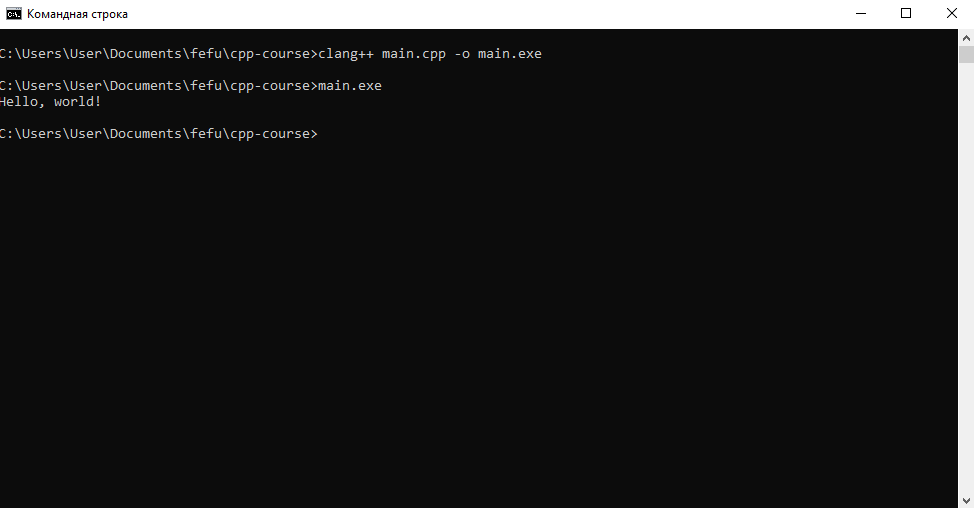

# Установка компилятора clang и других утилит llvm
1. Для установки компилятора `clang` на ОС Windows возможно скачать последнюю стабильную предкомпилированную версию установщика со [страницы релизов LLVM](https://releases.llvm.org/download.html).

2. При установке LLVM рекомендуется добавить исполняемые файлы в PATH.

3. После установки LLVM и добавления пути к исполняемым файлам LLVM в PATH, будет возможно запускать clang и различные утилиты LLVM напрямую из "терминала".

# 