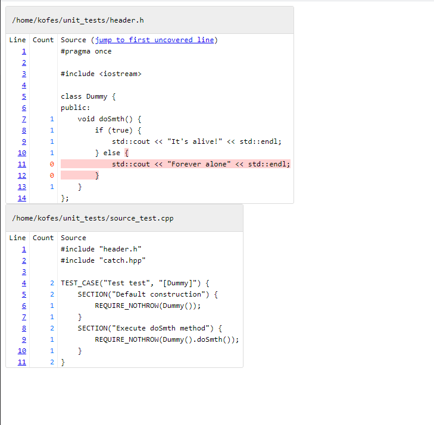

# Модульное тестирование

## Catch2

При реализиации заданий по лабораторным работам необходимо покрывать написанный код тестами.

При написании тестов желательно воспользоваться одной из готовых библиотек.

Здесь мы рассмотрим библиотеку [Catch2](https://github.com/catchorg/Catch2).

Для того, чтобы начать ей пользоваться, необходимо скачать последнюю версию заголовочного файла библиотеки.


Далее следуем туториалу, и добавляем заголовочный файл в проект, подключаем и пользуемся.

**[ВАЖНО]**: для того, чтобы при сборке проекта с Catch2 каждый раз не нужно было *пересобирать мир*, рекомендую 
сделать одно подключение заголовочного файла в исходник, где будет распологаться `main` функция и больше в этот исходник ничего не вставлять!
```cpp
// Полное содержание исходника, куда у вас будет "вставлена" реализация main функции
#define CATCH_CONFIG_MAIN  // This tells Catch to provide a main() - only do this in one cpp file
#include "catch.hpp"
```
**[Упоминание]**: если вы хотите поменять реализацию `main` функции при использовании `Catch2`, то можно посмотреть как это делается [здесь](https://github.com/catchorg/Catch2/blob/master/docs/own-main.md).

Далее мы компилируем исходник с `main` функцией.<br/>


После чего можно будет его никогда более не перекомпилировать (совсем). Можно будет его только линковать с другими исходниками.<br/>


## Покрытие кода

При написании кода требуется его максимальное покрытие тестами.

Для того, чтобы посмотреть покрытие собственного кода, возможно воспользоваться удобными для вас утилитами/библиотеками.
Ниже будут приведены примеры с проверкой покрытия с помощью [OpenCppCoverage](https://github.com/OpenCppCoverage/OpenCppCoverage) (Windows), [clang coverage](https://clang.llvm.org/docs/SourceBasedCodeCoverage.html) (Linux/MacOS).

### OpenCppCoverage

Возможно воспользоваться OpenCppCoverage как отдельной утилитой, так и в качестве плагина для Visual Studio. Однако, исходя из описания данных продуктов, следует, что в любом случае на ПК должна быть установлена Visual Studio.

Рассмотрим `OpenCppCoverage` в качестве плагина для Visual Studio.

#### Установка
1. Необходимо перейти в меню *Visual Studio* и открыть менеджер расширений: `Extensions` -> `Manage Extensions... [Ctrl+Shift+X]`<br/>

2. В открывшемся окне необходимо выполнить поиск расширения по названию **OpenCppCoverage** и установить найденное расширение<br/>

3. После необходимо будет перезапустить *Visual Studio* с целью дальнейшей установки расширения.
4. После перезапуска в меню `Tools` *Visual Studio* появятся опции `Run OpenCppCoverage` и `OpenCppCoverage Settings`<br/>


#### Использование
1. Для получения информации о покрытии кода, необходимо запустить `Tools` -> `Run OpenCppCoverage [Ctrl + R, Ctrl + C]`
2. После использования в окне `Coverage` появится список файлов проекта с краткой информацией о проценте покрытого кода
3. При открытии файла из окна `Coverage` возможно увидеть участки покрытого кода
4. Чтобы отключить подсветку покрытия кода в файле, достаточно убрать галочку в пункте `Display coverage` в верхней части окна `Coverage`<br/>


### clang coverage

1. Собираем проект с флагами `-fprofile-instr-generate -fcoverage-mapping`.<br/>

2. Пишем в какой файл будет записана информация после запуска билда и запускаем билд.<br/>

3. Проиндексируем данные из файла и выведем информацию о покрытии в консоль<br/>

**[Упоминание]**: Возможно сгенерировать отчет в html формате, если добавить флаг `-format=html`.<br/>
<br/>

